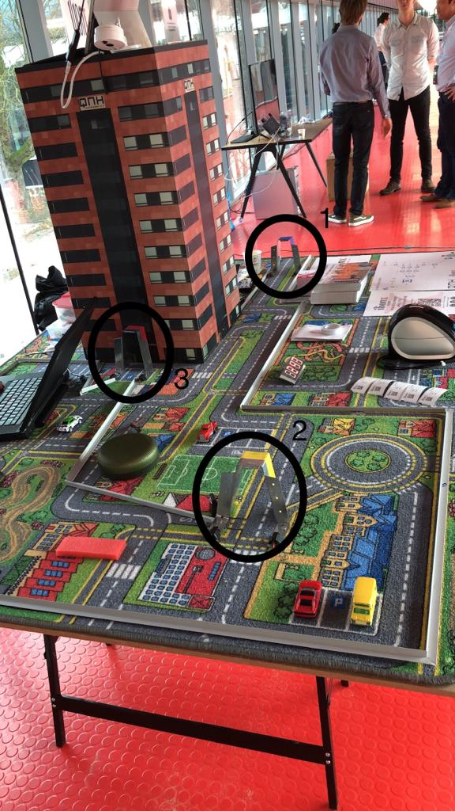
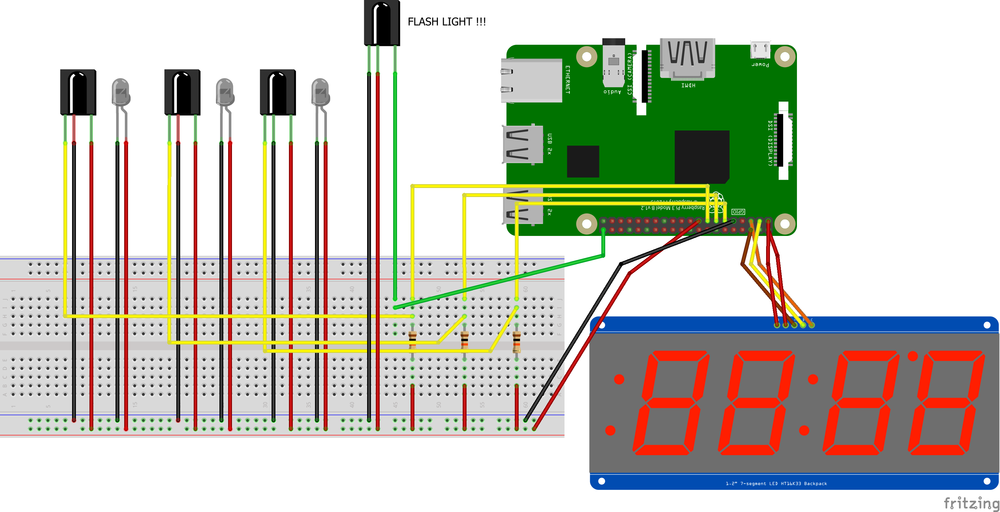
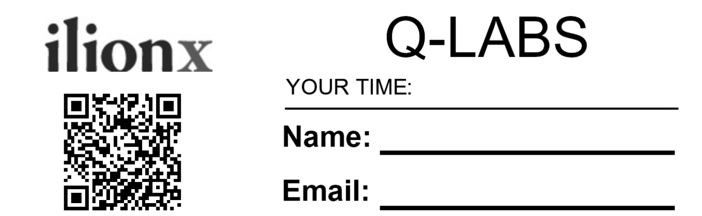

# QNH - Parktimer

The parktimer is a python application specially created for racing purposes.

To see this application in action click on the following Youtube link: [demonstration](https://youtu.be/7e_Cq-uBEMg).

#### Game manual

The course is simpel, you have to drive through three gates.
The first gate will start the timer, second gate will flash the xenon light and the last gate will stop the timer and print the label with the driven time on it.

Beneath is a picture of our stand at the TU in Eindhoven, three circles are placed around the gates.



#### Wiring



#### Requirements

- Raspberry Pi
- Dymo Labelwriter 450
- 1.2" 7-segment LED HT16K33 Backpack ([information](https://www.adafruit.com/product/1270))
- Three IR Break Beam Sensors ([information](https://www.adafruit.com/product/2168))
- Three 10K resistors ([information](https://www.adafruit.com/product/2784))
- XENON REMOTED STROBE FLASH FLIGHT LIGHT ([information](https://alexnld.com/product/xenon-remoted-strobe-flash-flight-light-with-bright-led-navigation-lights-for-fpv-racing/?gclid=Cj0KCQiA5NPjBRDDARIsAM9X1GJSL8wIRPIScwYFA2MiGTdIRPDuz0uGO0BjQvmzhfD8X3ETlRSgHoAaAkU9EALw_wcB))

#### Installation

    $ pip install -r requirements.txt

This command installs the Adafruit-LED-Backpack libraray needed for the 1.2" 7-segment LED HT16K33 Backpack.

Next we need to install CUPS (Common Unix Printing System) so we can use the Dymo Labelwriter as a printer on the Raspberry Pi.

    $ sudo apt-get update
    $ sudo apt-get install cups
    $ sudo usermod -a -G lpadmin pi

If you want remote access than you'll need to make a few changes in the config file, to do so run the command:

    $ sudo nano /etc/cups/cupsd.conf

First change the first lines to the following:

```
# Only listen for connections from the local machine
# Listen localhost:631
Port 631
```

Scroll further down in the config file until you see the “location” sections. Add the lines with <b>ADD THIS LINE</b> behind them.

```
< Location / >

# Restrict access to the server...

Order allow,deny
Allow @local                                        ADD THIS LINE
< /Location >

< Location /admin >

# Restrict access to the admin pages...

Order allow,deny
Allow @local                                        ADD THIS LINE
< /Location >

< Location /admin/conf >
AuthType Default
Require user @SYSTEM

# Restrict access to the configuration files...

Order allow,deny
Allow @local                                        ADD THIS LINE
< /Location >
```

Restart CUPS by issuing the following:

    $ sudo /etc/init.d/cups restart

You should now be able to access the print server on any local computer by typing http://{raspberry pi's IP address}:631

Next we will need to install the cups libraries and other necessary libraries to build

    $ sudo apt-get install libcups2-dev libcupsimage2-dev g++ cups

Now download the Dymo SDK and install the drivers

    $ wget http://download.dymo.com/Download%20Drivers/Linux/Download/dymo-cups-drivers-1.4.0.tar.gz
    $ tar xvf dymo-cups-drivers-1.4.0.tar.gz
    $ git clone https://aur.archlinux.org/dymo-cups-drivers.git

Copy the files inside the dymo-cups-drivers folder into the dymo-cups-drivers-1.4.0 folder

    $ cd dymo-cups-drivers-1.4.0.5/
    $ patch -Np1 -i cups-ppd-header.patch
    $ sudo ./configure
    $ sudo make
    $ sudo make install

Now you can plug the Dymo Labelwriter into a USB port on the Raspberry Pi and go to localhost:631 or remote to http://{raspberry pi's IP address}:631.

Then click on add printer on the admin page and follow the steps on the page and after it is added you're done with the installation.

#### Configuration

You have to configure to things:

- Label image
- Printer name

Change the path in the line of code in the Python script: `image = Image.open("/home/pi/label.png")`, so it will match your label.
Next, change the x and y coordinates so the time is written at the place of your desire. You can test it with: `image.show()`.

At last you have to change the variable `printer_name` with the name you configured the printer, in our case it is "DYMO_LabelWriter_450".

Our label looks like this:


#### Running

    $ python ./parktimer.py

### Resources

| Plugin   | Website             |
| -------- | ------------------- |
| Pip      | [pypi.org][pip]     |
| CUPS     | [cups.org][cups]    |
| Dymo SDK | [dymo.com][dymosdk] |

[pip]: https://pypi.org/project/pip/
[cups]: https://www.cups.org/
[dymosdk]: http://www.dymo.com/nl-NL/dymo-label-sdk-and-cups-drivers-for-linux-dymo-label-sdk-cups-linux-p--1
